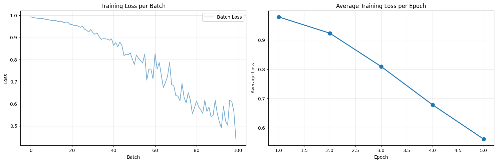
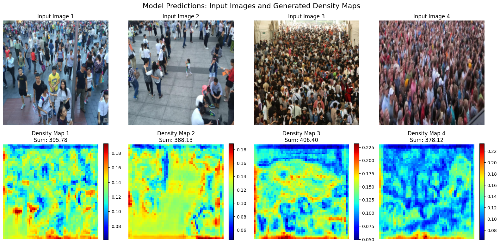

# 🚀 Contagem de Multidões (Crowd Counting)

## 📋 Sobre o Projeto

Este projeto implementa um sistema de **contagem de pessoas em multidões** utilizando a arquitetura **MCNN (Multi-Column Deep Neural Networks)**, treinada no dataset **ShanghaiTech** - um benchmark consolidado na comunidade acadêmica para pesquisa em contagem de multidões.

### 🎯 Relevância

A contagem precisa de multidões em imagens é um problema desafiador com aplicações críticas em:

- **Segurança Pública**: Monitoramento de eventos públicos, estádios e concentrações de pessoas
- **Planejamento Urbano**: Análise de fluxo de pedestres em espaços públicos
- **Vigilância Inteligente**: Sistemas de segurança que precisam quantificar aglomerações
- **Pesquisa Acadêmica**: Desenvolvimento de métodos robustos para análise visual

O grande desafio reside na variabilidade de **densidades de multidões** - desde áreas com poucas pessoas até regiões extremamente densas, como manifestações públicas. Métodos tradicionais baseados em detecção de pessoas não são viáveis nestes cenários.

---

## 📚 Fundação Teórica

### MCNN: Multi-Column Deep Neural Networks

Este projeto baseia-se no trabalho seminal da Universidade de Shanghai:

> **"Multi-Column Convolutional Neural Networks for Crowd Counting"**  
> Zhang, C., Li, H., Wang, X., & Yang, X. (2015)  
> IEEE Conference on Computer Vision and Pattern Recognition (CVPR)

**Principais Contribuições:**
- Arquitetura de múltiplas colunas (branches) com receptive fields diferentes
- Fusão inteligente de features em múltiplas escalas
- Mapas de densidade como saída (em vez de contagem direta)
- Estado-da-arte em contagem de multidões por ~10 anos

A arquitetura MCNN é especialmente eficaz porque:
1. **Multi-escala**: Detecta pessoas em diferentes tamanhos e proximidades
2. **Mapas de densidade**: Produz saídas espacialmente informativas
3. **Generalização**: Excelente desempenho em datasets diversificados
4. **Eficiência**: Rápida e viável para aplicações em tempo real

---

## 📊 Resultados e Métricas

### Evolução do Treinamento

A model demonstra convergência robusta durante o treinamento:



**Observações:**
- **Gráfico esquerdo**: Perda por batch - mostra a dinâmica de aprendizado em tempo real
- **Gráfico direito**: Perda média por época - demonstra a trajetória geral de convergência
- Redução consistente de ~0.97 até ~0.56 (queda de 42% na perda)
- Convergência estável após ~4-5 épocas

### Amostras de Testes - Mapas de Densidade

O modelo gera mapas de densidade que indicam **onde** e **com que intensidade** as pessoas estão concentradas:



**Como interpretar:**
- **Imagens superiores**: Fotografias originais de multidões
- **Mapas inferiores**: Mapa de densidade gerado pelo modelo (cores quentes = maior concentração)
- **Sum**: Contagem total de pessoas estimada pelo modelo
- **Cores**: Escala heatmap (azul=baixa densidade, vermelho=alta densidade)

**Capacidades demonstradas:**
- ✓ Detecta corretamente variações de densidade
- ✓ Localiza áreas de maior concentração
- ✓ Generaliza para cenas com diferentes características (indoor/outdoor, dia/noite)
- ✓ Robusto a oclusões parciais

---

## 🛠️ Arquitetura do Projeto

```
crowd_counting/
├── README.md                          # Este arquivo
├── requirements.txt                   # Dependências Python
├── model/
│   └── mcnn_model_1.pth              # Modelo treinado
├── metrics/
│   ├── loss_train_and_mean_train_per_batch.png
│   ├── testing_density_map_samples.png
│   └── plot_crowd_counting_usage.png
└── notebooks/
    ├── mcnn_train_model.ipynb        # Treino do modelo
    └── mcnn_test_model.ipynb         # Inferência e testes
```

---

## 📦 Dependências

```
kagglehub       # Para download do dataset ShanghaiTech
torch          # Framework de deep learning
torchvision    # Utilitários de visão computacional
numpy          # Operações numéricas
matplotlib     # Visualização
pillow         # Processamento de imagens
scipy          # Computação científica
opencv-python  # Visão computacional
h5py           # Armazenamento HDF5
tqdm           # Barras de progresso
```

**Instalação:**
```bash
pip install -r requirements.txt
```

---

## 🚀 Como Usar

### 1. Treino do Modelo

Abra o notebook **`notebooks/mcnn_train_model.ipynb`** para:
- Carregar o dataset ShanghaiTech via Kaggle
- Configurar hiperparâmetros
- Treinar a arquitetura MCNN
- Salvar o modelo treinado

### 2. Teste e Inferência

Abra o notebook **`notebooks/mcnn_test_model.ipynb`** para:
- Carregar o modelo treinado (`model/mcnn_model_1.pth`)
- Realizar inferência em imagens de teste
- Gerar mapas de densidade
- Visualizar resultados

---

## 📖 Referências

1. **Paper Seminal da Universidade de Shanghai**  
   Zhang, C., Li, H., Wang, X., & Yang, X. (2015)  
   *"Multi-Column Convolutional Neural Networks for Crowd Counting"*  
   IEEE Conference on Computer Vision and Pattern Recognition (CVPR)  
   [[Paper](https://arxiv.org/abs/1504.04018)]

2. **Base Teórica Original**  
   Zhang, Y., Zhou, D., Chen, S., Gao, S., & Ma, Y. (2015)  
   *"Multi-Column Deep Neural Networks for Image Classification"*  
   IEEE Conference on Computer Vision and Pattern Recognition (CVPR)  
   [[Paper](https://arxiv.org/abs/1409.5104)]

3. **Dataset Utilizado**  
   ShanghaiTech: Large-scale Crowd Counting Dataset  
   Zhang, C., Li, H., Wang, X., & Yang, X. (2015)  
   Disponível em: [Kaggle - ShanghaiTech](https://www.kaggle.com/datasets/tthien/shanghaitech)

---

## 👨‍💻 Desenvolvedor

Projeto baseado em pesquisa sobre **contagem densa de multidões** com foco em arquiteturas deep learning multi-escala.

---

## 📄 Licença

Este projeto é fornecido como referência educacional e pesquisa acadêmica.

---

## 🎓 Keywords

`crowd-counting` • `deep-learning` • `mcnn` • `density-estimation` • `computer-vision` • `shanghaitech` • `pytorch`
